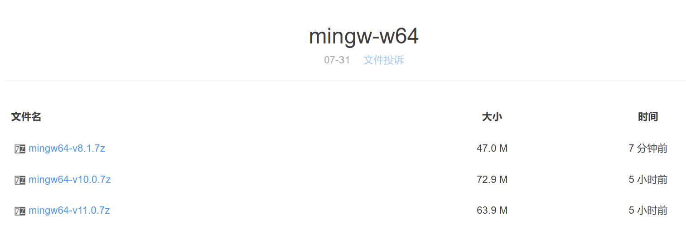
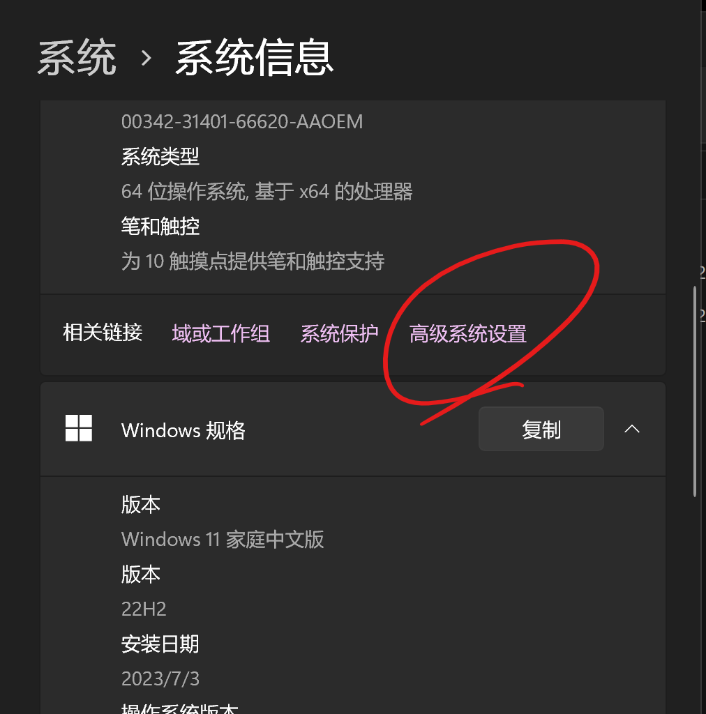
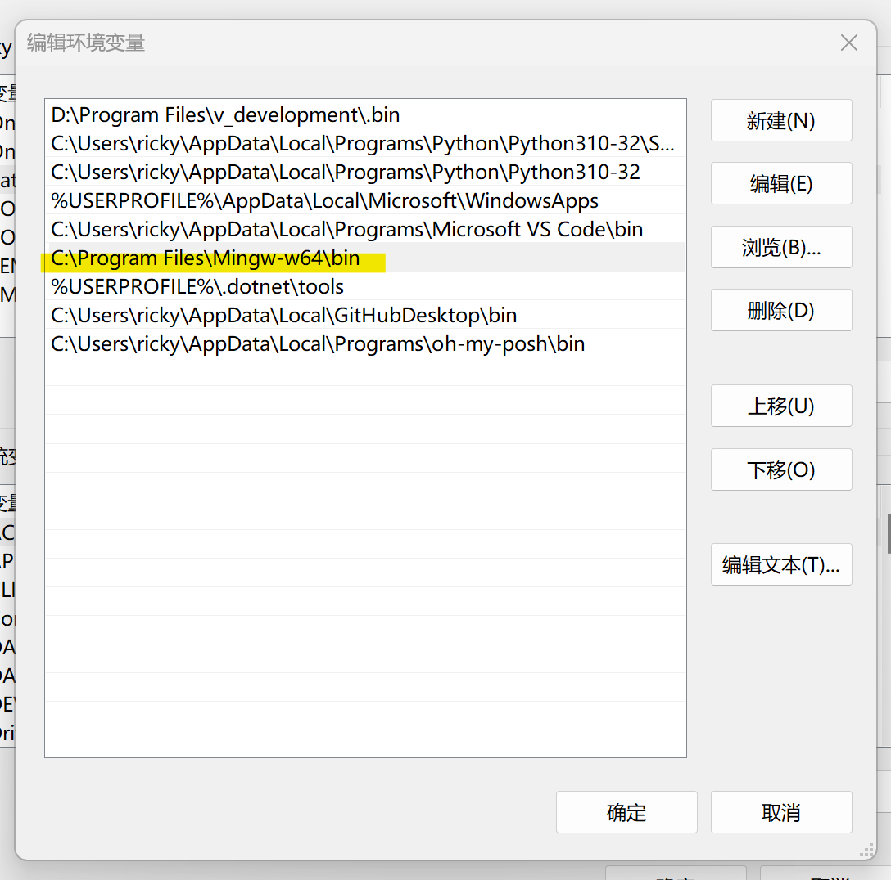

### 何为MinGW64

MinGW是知名的c++编译器，而MinGW64则是其加强版

网传的Github，SourceForge等下载渠道速度都不堪设想，再此，`FBIWZH`做了一个整理。

### 安装教程

1. 点击下载链接，输入密码，选择你想要的版本

2. 下载后，解压文件

3. 配置环境变量，在    设置$\rarr$系统$\rarr$高级系统设置$\rarr$高级$\rarr$环境变量...    中的`Path`添加你的解压后的bin路径：

   

4. 在控制台输入`gcc -v`以测试，如果没有报错则安装成功

#### 下载链接

https://fbiwzh.lanzoub.com/b042eb13g
密码:1919810